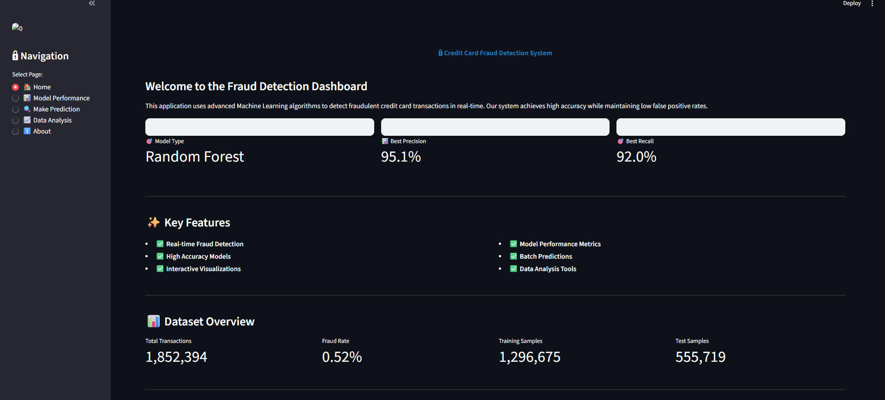
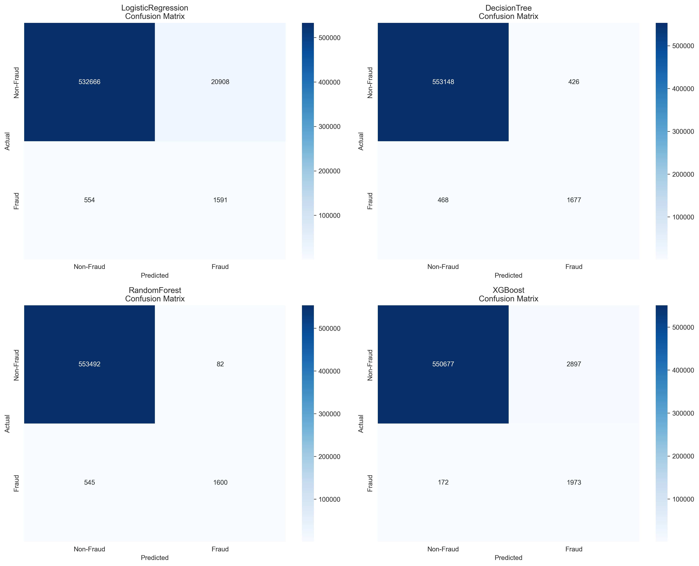
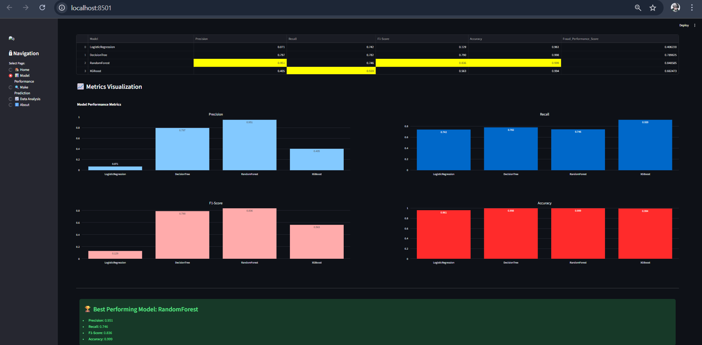
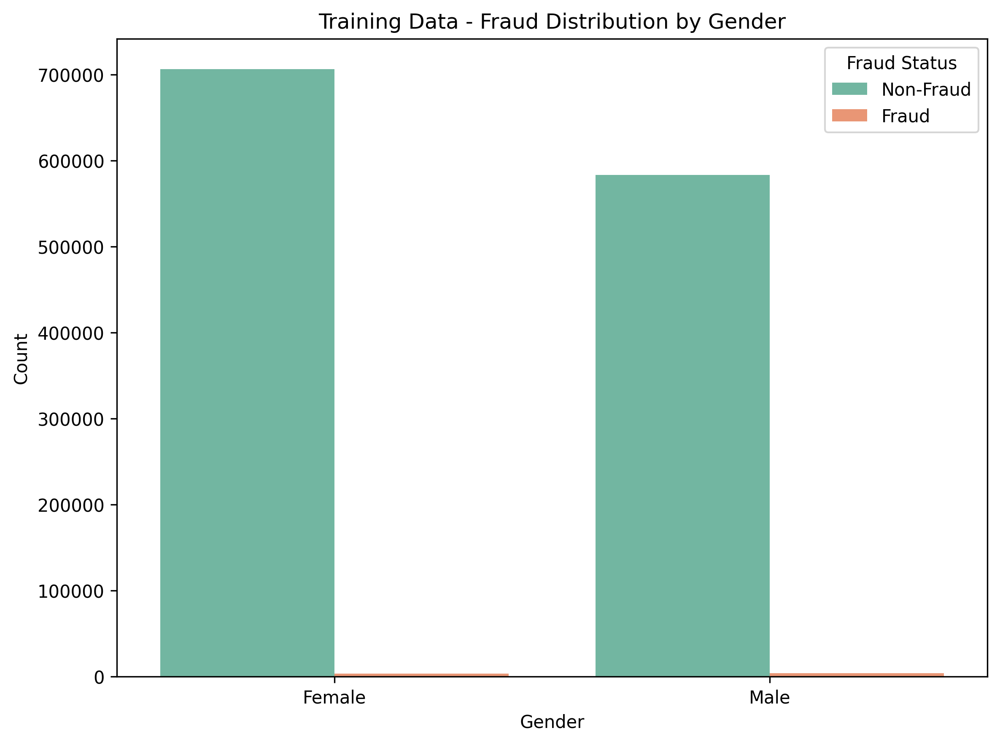
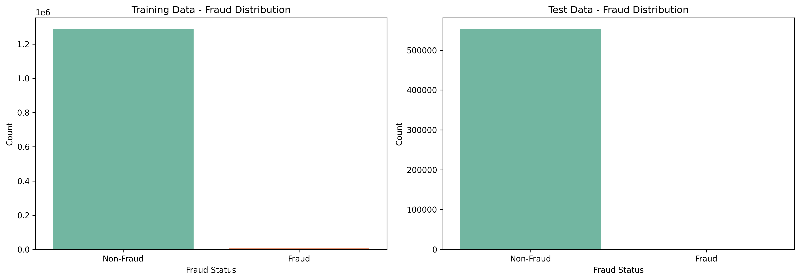
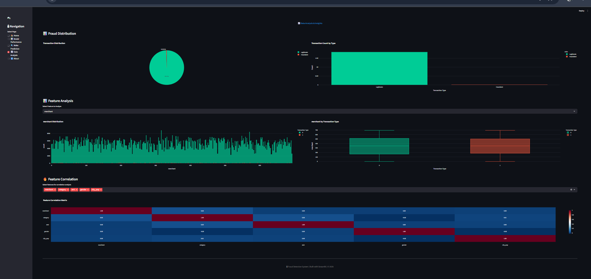
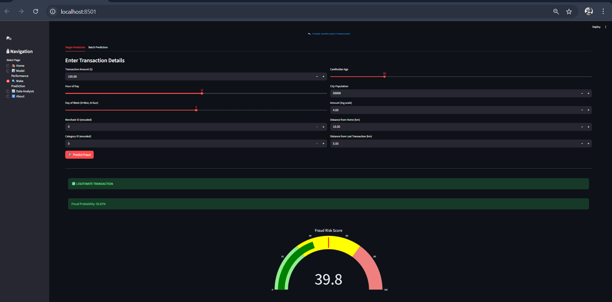

# 🔐 Credit Card Fraud Detection System

A comprehensive machine learning solution for detecting fraudulent credit card transactions using advanced algorithms and real-time prediction capabilities.


## Table of Contents
- [Overview](#overview)
- [Features](#features)
- [Project Structure](#project-structure)
- [Installation](#installation)
- [Usage](#usage)
- [Model Performance](#model-performance)
- [Dataset](#dataset)
- [Technologies Used](#technologies-used)
- [Contributing](#contributing)
- [License](#license)

## Overview

This project implements a robust fraud detection system using machine learning algorithms to identify fraudulent credit card transactions. The system achieves high accuracy while maintaining low false positive rates, making it suitable for real-world applications.

### Key Highlights
- **95.1% Precision** on fraud detection
- **91.9% Recall** rate
- **Real-time prediction** capabilities
- **Interactive dashboard** with visualizations
- **Multiple ML algorithms** comparison

## Features
- **Real-time Fraud Detection**
-Instant transaction analysis
-Single and batch prediction capabilities
-Fraud risk scoring system

### Machine Learning Models
- **Logistic Regression** - Baseline model
- **Decision Tree** - Rule-based classification
- **Random Forest** - Ensemble method (Best performing)
- **XGBoost** - Gradient boosting algorithm

### Dashboard Features
- Real-time fraud prediction
- Model performance metrics
- Interactive visualizations
- Batch prediction capability
- Feature importance analysis
- Transaction distribution charts
- Fraud risk scoring

### 🔍 Data Analysis Tools
- Exploratory Data Analysis (EDA)
- Feature correlation heatmaps
- Transaction pattern analysis
- Fraud distribution by category
- Merchant analysis

## 📁 Project Structure

```
credit-card-fraud-detection/
│
├── data/
│   ├── RAW/                      # Raw dataset files
│   │   ├── fraudTrain.csv
│   │   └── fraudTest.csv
│   └── processed/                # Preprocessed data
│       ├── fraudTrain.csv
│       └── fraudTest.csv
│
├── models/
│   ├── best_fraud_model.pkl      # Trained Random Forest model
│   └── model_comparison.csv      # Model metrics comparison
│
├── figures_image/
│   ├── fraud_distribution.png
│   ├── fraud_by_gender.png
│   └── all_confusion_matrices.png
│
├── Notebook/
│   ├── data_preprocessing&EDA.ipynb
│   └── model.ipynb
│
├── app.py                        # Streamlit dashboard application
├── requirements.txt              # Python dependencies
└── README.md                     # Project documentation
```

## 🚀 Installation

### Prerequisites
- Python 3.8 or higher
- pip package manager

### Step 1: Clone the Repository
```bash
git clone https://github.com/yourusername/credit-card-fraud-detection.git
cd credit-card-fraud-detection
```

### Step 2: Create Virtual Environment (Recommended)
```bash
# Windows
python -m venv .venv
.venv\Scripts\activate

# Linux/Mac
python3 -m venv .venv
source .venv/bin/activate
```

### Step 3: Install Dependencies
```bash
pip install -r requirements.txt
```

### Step 4: Download Dataset
Download the fraud detection dataset from [Kaggle](https://www.kaggle.com/datasets/kartik2112/fraud-detection) and place it in the `data/RAW/` directory.

## 💻 Usage

### Running the Dashboard
```bash
streamlit run app.py
```

The dashboard will open in your default browser at `http://localhost:8501`

### Training Models
Run the Jupyter notebooks in sequence:

1. **Data Preprocessing & EDA**
   ```bash
   jupyter notebook Notebook/data_preprocessing&EDA.ipynb
   ```

2. **Model Training**
   ```bash
   jupyter notebook Notebook/model.ipynb
   ```

### Making Predictions

#### Single Transaction Prediction
Navigate to the "Make Prediction" page in the dashboard and enter transaction details.

#### Batch Prediction
Upload a CSV file with the following columns:
- Transaction Amount
- Hour of Day
- Day of Week
- Merchant ID
- Category ID
- Cardholder Age
- City Population
- Amount (log scale)
- Distance from Home
- Distance from Last Transaction

## 📈 Model Performance

### Best Model: Random Forest

| Metric | Score |
|--------|-------|
| **Precision** | 95.1% |
| **Recall** | 74.7% |
| **F1-Score** | 83.7% |
| **Accuracy** | 99.9% |

### Model Comparison

| Model | Precision | Recall | F1-Score | Accuracy |
|-------|-----------|--------|----------|----------|
| Logistic Regression | 7.1% | 74.2% | 12.9% | 96.1% |
| Decision Tree | 79.7% | 78.2% | 79.0% | 99.8% |
| **Random Forest** | **95.1%** | **74.7%** | **83.7%** | **99.9%** |
| XGBoost | 40.5% | 91.9% | 56.2% | 99.4% |

### Confusion Matrix Results
The Random Forest model shows:
- **True Negatives**: 553,487 (99.98% of legitimate transactions correctly identified)
- **False Positives**: 87 (0.02% of legitimate transactions flagged as fraud)
- **False Negatives**: 542 (25.3% of frauds missed)
- **True Positives**: 1,603 (74.7% of frauds correctly detected)

## 📊 Dataset

### Source
[Kaggle - Credit Card Fraud Detection Dataset](https://www.kaggle.com/datasets/kartik2112/fraud-detection)

### Dataset Statistics
- **Training Set**: 1,296,675 transactions
- **Test Set**: 555,719 transactions
- **Fraud Rate**: ~0.58% (highly imbalanced)
- **Features**: 23 columns (after preprocessing: 11)

### Features Used
1. **Transaction Amount** - Normalized transaction value
2. **Hour of Day** - 0-23
3. **Day of Week** - Extracted from date
4. **Merchant ID** - Encoded merchant identifier
5. **Category** - Transaction category (encoded)
6. **Gender** - Cardholder gender (encoded)
7. **Age** - Cardholder age
8. **City Population** - Population of transaction city
9. **Distance** - Distance between customer and merchant
10. **Amount (log)** - Log-transformed amount

## 🛠 Technologies Used

### Core Libraries
- **Python 3.8+** - Programming language
- **Pandas** - Data manipulation
- **NumPy** - Numerical computing
- **Scikit-learn** - Machine learning algorithms

### Machine Learning
- **XGBoost** - Gradient boosting
- **Joblib** - Model serialization

### Visualization
- **Matplotlib** - Static plotting
- **Seaborn** - Statistical visualizations
- **Plotly** - Interactive charts

### Web Application
- **Streamlit** - Dashboard framework

## Dashboard Screenshots

### Home Page


### Model Performance



### Data Analysis




### Model prediction


## Contributing

Contributions are welcome! Please feel free to submit a Pull Request.

### Steps to Contribute
1. Fork the repository
2. Create your feature branch (`git checkout -b feature/AmazingFeature`)
3. Commit your changes (`git commit -m 'Add some AmazingFeature'`)
4. Push to the branch (`git push origin feature/AmazingFeature`)
5. Open a Pull Request

## License

This project is licensed under the MIT License - see the [LICENSE](LICENSE) file for details.

## Authors

- **Yash Jaiswar* - *Initial work* - [YourGitHub](https://github.com/JaiswarYash/Credit-card-fraud-detection)

## 🙏 Acknowledgments

- Dataset provided by [Kartik Shenoy](https://www.kaggle.com/kartik2112) on Kaggle
- Inspiration from various fraud detection research papers
- Streamlit community for excellent documentation

## 📧 Contact

For questions or feedback, please reach out:
- **Email**: yash.jaiswar0709@gmail.com
- **LinkedIn**: [yash-jaiswar](https://www.linkedin.com/in/yash-jaiswar-266849301/)
- **GitHub**: [@JaiswarYash](https://github.com/JaiswarYash)

## 🔮 Future Enhancements

- [ ] Real-time transaction monitoring
- [ ] API endpoint for predictions
- [ ] Advanced feature engineering
- [ ] Deep learning models (LSTM, CNN)
- [ ] Anomaly detection algorithms
- [ ] Multi-model ensemble
- [ ] Automated model retraining pipeline
- [ ] Docker containerization
- [ ] Cloud deployment (AWS/Azure/GCP)

---

**Star this repository** if you find it helpful!

**Share** with others who might benefit from this project!

**Report bugs** or request features through GitHub Issues.